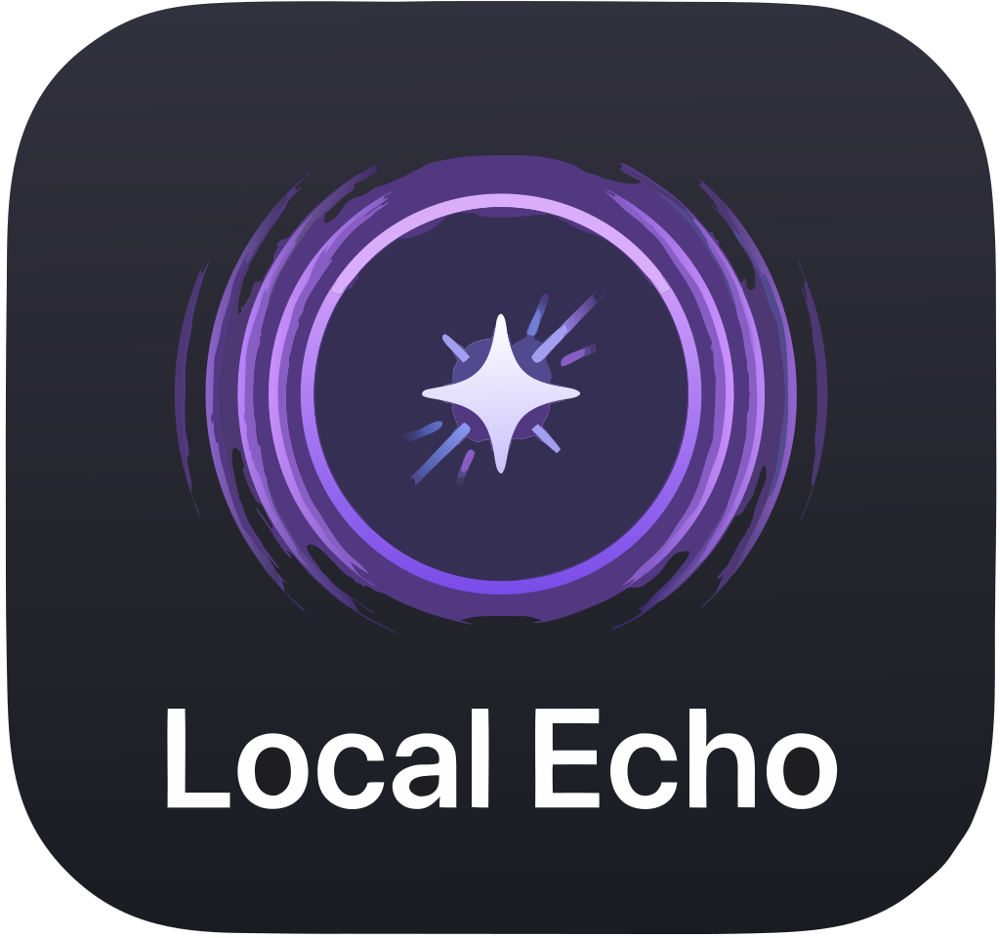
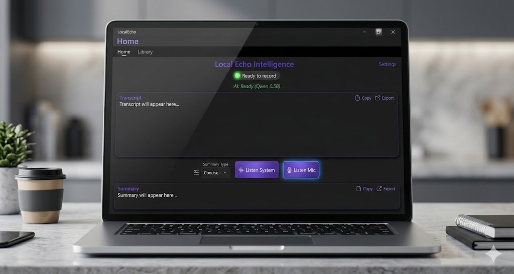

# LocalEcho 

> **100% Offline, On-Device Speech Transcription & AI Summarization**

[](https://dotnet.microsoft.com/)
[](https://learn.microsoft.com/dotnet/maui/)
[](https://learn.microsoft.com/dotnet/csharp/)
[](LICENSE)
[](#)
[](#)

---

<div align="center">
  
  <br/>
  <em>LocalEcho — Record. Transcribe. Summarize. All on your device.</em>
</div>

---

## Overview

**LocalEcho** is a cross-platform desktop application that records audio, transcribes speech to text using OpenAI's Whisper model, and generates intelligent summaries using on-device LLMs (Qwen, Llama, Phi-3). Every operation runs **entirely offline** — no data ever leaves your machine.

This repository showcases the **architecture, design decisions, and selected implementation patterns** used to build LocalEcho. The production implementation remains private while this repository demonstrates engineering practices, system design, and technical decision-making.

---

## Key Features

| Capability | Details |
|---|---|
| 🎤 **Audio Capture** | Microphone & system audio recording (Windows, macOS, Android) |
| 📝 **Speech-to-Text** | Local Whisper models (Tiny → Small, English & multilingual) |
| 🤖 **AI Summarization** | 4 summary modes: Concise, Detailed, Action Items, Q&A |
| 🧠 **RAG Chat** | "Library Brain" — ask questions over your transcript library |
| 🔒 **100% Offline** | All models run locally — zero data exfiltration |
| 🏷️ **Smart Titling** | AI-generated titles for recordings |
| ⭐ **Favorites** | Bookmark important entries |
| 📤 **Export** | Save transcripts & summaries as text files |
| 🌓 **Theme** | Light / Dark / System theme support |
| 💻 **Cross-Platform** | Windows, macOS, Android (single .NET MAUI codebase) |

---

## Tech Stack

| Layer | Technology |
|---|---|
| **Framework** | .NET 9 / .NET MAUI |
| **Language** | C# 12 |
| **Pattern** | MVVM (CommunityToolkit.Mvvm) |
| **DI** | Built-in Microsoft Dependency Injection |
| **Speech-to-Text** | Whisper.net (OpenAI Whisper) |
| **LLM Inference** | LLamaSharp (llama.cpp bindings) |
| **Models** | Qwen 2.5 (0.5B/1.5B), Llama 3.2 (1B), Phi-3 Mini |
| **Storage** | SQLite (sqlite-net-pcl) |
| **Audio (Win)** | NAudio (WasapiLoopbackCapture) |
| **Audio (macOS)** | AVFoundation |
| **Audio (Android)** | AudioRecord / MediaProjection |
| **UI Toolkit** | CommunityToolkit.Maui |

---

## Architecture Overview

```
┌──────────────────────────────────────────────────┐
│                    UI Layer                      │
│  MainPage  │  LibraryPage  │  EntryDetailPage    │
│  SettingsPage  │  LibraryChatPage                │
└──────────────────┬───────────────────────────────┘
                   │ BindingContext
┌──────────────────▼───────────────────────────────┐
│               ViewModel Layer                    │
│  MainViewModel  │  LibraryViewModel              │
│  OnboardingViewModel                             │
│  └── CommunityToolkit.Mvvm (ObservableObject)    │
└──────────────────┬───────────────────────────────┘
                   │ Commands / Events
┌──────────────────▼───────────────────────────────┐
│              Service Layer                       │
│  AudioService  │  TranscriptionService           │
│  SummarizationService  │  LibraryService         │
│  ProService                                      │
│  └── Interface-based abstractions                │
└──────┬──────────────┬──────────────┬─────────────┘
       │              │              │
┌──────▼──────┐ ┌──────▼──────┐ ┌──────▼──────────┐
│  NAudio /   │ │  Whisper    │ │  LLamaSharp     │
│  AVF / AR   │ │  .NET       │ │  (Qwen/Llama)   │
│  Audio      │ │  Models     │ │  LLM Inference  │
└─────────────┘ └─────────────┘ └─────────────────┘
```

**Design Patterns:**
- **MVVM** — Clean separation between UI, presentation logic, and business logic
- **Repository** — `LibraryService` abstracts SQLite data access
- **Strategy** — Multiple summary type implementations via `SummaryType` enum
- **Map-Reduce** — Chunked summarization for long transcripts
- **Dependency Injection** — All services registered through `IServiceCollection`
- **Observer** — `INotifyPropertyChanged` via CommunityToolkit source generators

> 📖 **Detailed architecture documentation:** [docs/architecture.md](docs/architecture.md)

---

## Challenges & Solutions

| Challenge | Solution |
|---|---|
| **Long transcript summarization** | Implemented Map-Reduce chunking: split transcript → summarize each chunk → consolidate into final summary |
| **LLM model crash on long context** | Model-specific context sizing (4K tokens for Phi-3, 16K for Qwen/Llama) with dynamic GPU layer allocation |
| **Multi-platform audio capture** | Platform-specific audio services behind a unified interface with conditional compilation |
| **Model download resilience** | Primary HuggingFace download with automatic China mirror fallback; partial file cleanup on failure |
| **Android system audio** | AudioPlaybackCapture API with MediaProjection permission, with graceful microphone fallback |
| **Mobile GPU constraints** | Device capability detection; Android-specific LLM runtime verification before allowing downloads |
| **Deduplication of model output** | Repetition penalty (1.2), anti-prompt truncation, and regex-based repetition cleanup |

---

## Getting Started (Development)

```bash
# Prerequisites: .NET 9 SDK, Visual Studio 2022 (or JetBrains Rider)

# Clone the showcase repository
git clone https://github.com/yourusername/LocalEcho-Showcase.git

# Build for Windows
cd LocalEcho
dotnet build -f net9.0-windows10.0.19041.0

# Build for macOS
dotnet build -f net9.0-maccatalyst

# Publish for Windows
dotnet publish -f net9.0-windows10.0.19041.0 -c Release
```

> **Note:** This is a showcase repository. The full production source code with all features and complete implementation is maintained separately.

---

## Sample Code

| Example | Description |
|---|---|
| [Service Interfaces](sample-code/01-service-interfaces.md) | Clean interface design for audio, transcription, and summarization |
| [ViewModel Pattern](sample-code/02-viewmodel-pattern.md) | MVVM with CommunityToolkit source generators |
| [Data Model](sample-code/03-data-model.md) | SQLite-backed entity design |
| [Map-Reduce Summarization](sample-code/04-map-reduce-summarization.md) | Handling arbitrarily long transcripts |
| [Dependency Injection](sample-code/05-di-setup.md) | Service registration and composition root |
| [Platform Abstraction](sample-code/06-platform-abstraction.md) | Cross-platform audio capture pattern |
| [RAG Chat](sample-code/07-rag-chat.md) | Retrieval-augmented generation over local library |

---

## Screenshots

*Screenshots and screen recordings are available in the [screenshots](screenshots/) and [demo](demo/) directories.*

### Planned Visual Assets:
- [ ] Main recording screen (microphone + system audio modes)
- [ ] Transcript editing and reading view
- [ ] Summary generation with all 4 summary types
- [ ] Library view with search and filtering
- [ ] "Library Brain" RAG chat interface
- [ ] Settings page with model selection
- [ ] Dark mode comparison
- [ ] Architecture diagram

---

## Privacy & Security

LocalEcho was designed with **privacy as a first-class constraint**:

- ✅ **All processing is 100% on-device** — no cloud services, no data leakage
- ✅ **No telemetry, analytics, or tracking** — zero data collection
- ✅ **No account required** — no sign-up, no profile, no vendor lock-in
- ✅ **All data stored locally** — in device-local SQLite database
- ✅ **Full data control** — delete entries or reset entirely at any time
- ✅ **AI models run locally** — Whisper and LLM inference on-device only

---

## Engineering Highlights

- **Clean MVVM architecture** with interface-based service abstractions for testability
- **Conditional compilation** (#if WINDOWS, #elif MACCATALYST, #elif ANDROID) for platform-specific implementations behind a unified facade
- **Responsive UI** with dynamic progress indicators for long-running operations (model downloads, transcription, summarization)
- **Debounced search** with cancellation tokens for a responsive library browsing experience
- **AI-powered title generation** — automatically titles recordings without user input
- **RAG-based Q&A** — semantic search over local transcript library with contextual chat
- **Graceful fallbacks at every layer** — failed models → alternative models; failed system audio → microphone; failed download → mirror

---

## Future Improvements

- [ ] Continuous/streaming transcription during recording
- [ ] Search result highlighting and relevance scoring
- [ ] Automatic language detection improvements
- [ ] Batch export/import functionality
- [ ] Custom prompt configuration for summarization
- [ ] Audio playback integration
- [ ] Keyboard shortcuts and accessibility improvements
- [ ] Open-source reusable libraries for Whisper + LLM offline pipeline

---

## License

This project is available under the MIT License.

---

## Contact

For questions, feature requests, or collaboration inquiries, please open an issue or reach out via the project's discussion forum.

*Production implementation remains private. This repository showcases architecture, selected implementation examples, and technical decisions.*
