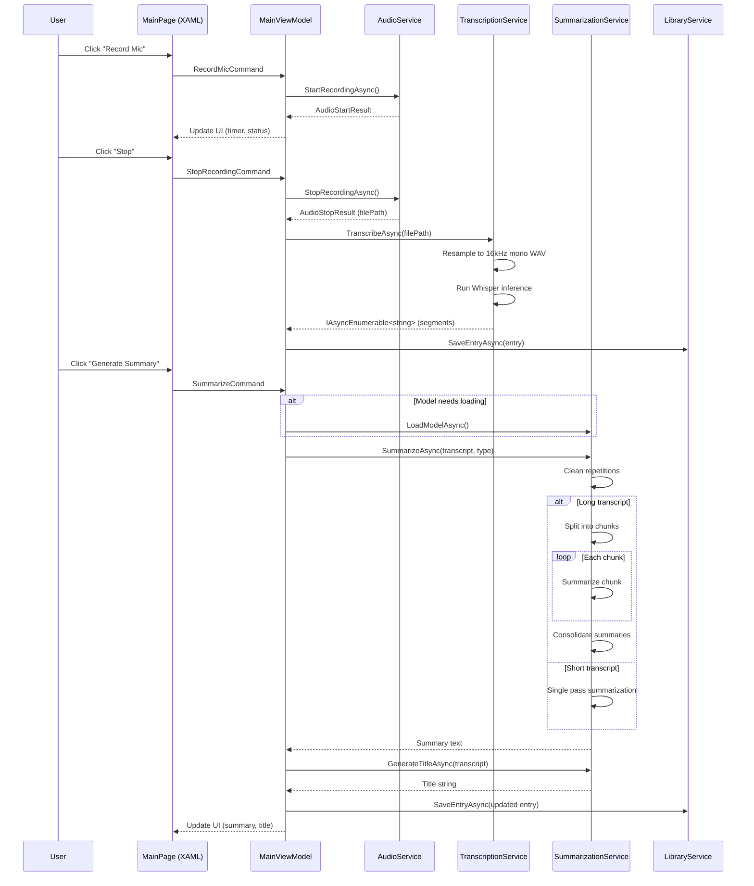
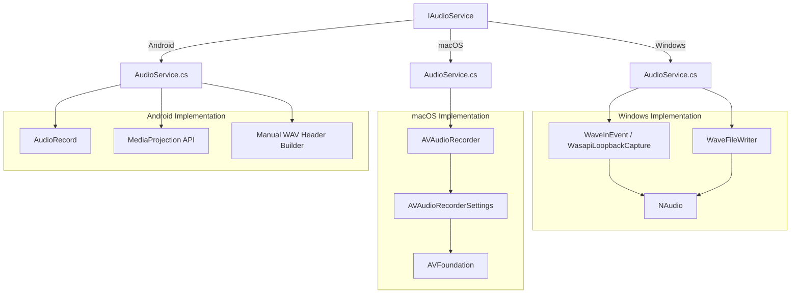
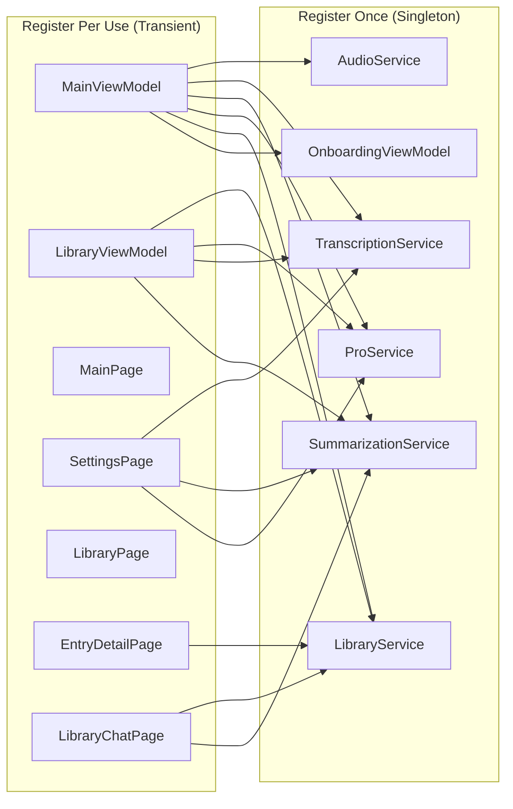

# Architecture Documentation

## System Overview

LocalEcho is a **cross-platform .NET MAUI desktop application** that performs speech-to-text transcription and AI-powered summarization entirely on-device. The architecture follows the **MVVM (Model-View-ViewModel)** pattern with a clean service layer, enabling testability, maintainability, and platform flexibility.

---

## Layer Architecture

```
┌─────────────────────────────────────────────────────────────────────┐
│                        PRESENTATION LAYER                           │
│  ┌─────────────┐ ┌──────────────┐ ┌───────────────┐                 │
│  │  MainPage   │ │ LibraryPage  │ │EntryDetailPage│                 │
│  │  (XAML)     │ │  (XAML)      │ │  (XAML)       │    Views        │
│  └──────┬──────┘ └──────┬───────┘ └───────┬───────┘                 │
│         │               │                 │                         │
│  ┌──────▼──────┐ ┌──────▼───────┐ ┌───────▼───────┐                 │
│  │MainViewModel│ │LibraryVM     │ │ (Code-behind) │   ViewModels    │
│  └──────┬──────┘ └──────┬───────┘ └───────────────┘                 │
│         │               │                                           │
│  ┌──────▼───────────────▼───────────────────────────────────┐       │
│  │       OnboardingViewModel (shared state)                 │       │
│  └──────────────────────────────────────────────────────────┘       │
└──────────────────────────┬──────────────────────────────────────────┘
                           │ DI / Constructor Injection
┌──────────────────────────▼───────────────────────────────────────────┐
│                         SERVICE LAYER                                │
│                                                                      │
│  ┌─────────────────┐  ┌──────────────────┐  ┌──────────────────┐     │
│  │  IAudioService  │  │ITranscriptionSrvc│  │ISummarizationSrvc│     │
│  │  AudioService   │  │TranscriptionSvc  │  │SummarizationSvc  │     │
│  └────────┬────────┘  └────────┬─────────┘  └────────┬─────────┘     │
│           │                    │                     │               │
│  ┌────────▼────────┐  ┌───────▼────────┐  ┌─────────▼──────────┐     │
│  │   LibrarySvc    │  │   ProService   │  │   AppPreferences   │     │
│  └────────┬────────┘  └────────────────┘  └────────────────────┘     │
└───────────┼──────────────────────────────────────────────────────────┘
            │
┌───────────▼──────────────────────────────────────────────────────────┐
│                        DATA / INFRASTRUCTURE LAYER                   │
│                                                                      │
│  ┌──────────────────┐  ┌──────────────────┐  ┌──────────────────┐    │
│  │   SQLite DB      │  │   Whisper Model  │  │  LLM Model File  │    │
│  │ (Transcriptions) │  │  (.bin GGML)     │  │  (.gguf)         │    │
│  └──────────────────┘  └──────────────────┘  └──────────────────┘    │
│                                                                      │
│  ┌──────────────────┐  ┌──────────────────┐  ┌──────────────────┐    │
│  │   Audio Files    │  │  Temp WAV Cache  │  │  Preferences     │    │
│  │  (.wav)          │  │  (resampled)     │  │  (MAUI Prefs)    │    │
│  └──────────────────┘  └──────────────────┘  └──────────────────┘    │
└──────────────────────────────────────────────────────────────────────┘
```

---

## Data Flow: Recording → Transcription → Summarization



---

## Cross-Platform Audio Strategy



---

## File Structure

```
LocalEcho/
├── Models/
│   └── TranscriptionEntry.cs       # SQLite-backed data model
├── ViewModels/
│   ├── MainViewModel.cs            # Primary recording/transcription logic
│   ├── LibraryViewModel.cs         # Library browsing & search
│   └── OnboardingViewModel.cs      # First-run setup wizard
├── Views/
│   ├── MainPage.xaml(.cs)          # Recording & transcription UI
│   ├── LibraryPage.xaml(.cs)       # Transcription library
│   ├── EntryDetailPage.xaml(.cs)   # Single entry view
│   ├── LibraryChatPage.xaml(.cs)   # RAG chat interface
│   └── SettingsPage.xaml(.cs)      # Model & theme settings
├── Services/
│   ├── IAudioService.cs            # Audio capture interface
│   ├── AudioService.cs             # Platform-specific audio
│   ├── ITranscriptionService.cs    # Speech-to-text interface
│   ├── TranscriptionService.cs     # Whisper integration
│   ├── ISummarizationService.cs    # LLM summarization interface
│   ├── SummarizationService.cs     # LLM integration + map-reduce
│   ├── LibraryService.cs           # SQLite repository
│   ├── IProService.cs             # Licensing interface
│   ├── ProService.cs               # Licensing implementation
│   ├── AppPreferences.cs           # Preferences constants
│   └── SummaryType.cs              # Summary strategy enum
├── Converters/
│   ├── DurationConverter.cs        # Seconds → mm:ss display
│   ├── FavoriteStarConverter.cs    # Bool → ★ display
│   └── StringNotEmptyConverter.cs  # String → visibility converter
├── Platforms/                      # Platform-specific bootstrapping
│   ├── Android/
│   ├── iOS/
│   ├── MacCatalyst/
│   ├── Tizen/
│   └── Windows/
├── Resources/                      # Fonts, styles, images
├── MauiProgram.cs                  # DI composition root
├── App.xaml(.cs)                   # Application entry point
└── AppShell.xaml(.cs)              # Navigation shell
```

---

## Dependency Injection Graph



---

## Model Lifecycle

### Transcription Model (Whisper)
1. **Download**: On-demand from HuggingFace with mirror fallback
2. **Storage**: AppDataDirectory as GGML `.bin` files
3. **Load**: Via `WhisperFactory.FromPath()` — auto-detects GPU (CUDA/Vulkan/CPU)
4. **Inference**: Processes 16kHz mono WAV, outputs timestamped text segments
5. **Cleanup**: Manual deletion via Settings

### Summarization Model (LLM: Qwen/Llama/Phi-3)
1. **Download**: On-demand from HuggingFace with mirror fallback
2. **Storage**: AppDataDirectory as GGUF files
3. **Load**: `LLamaWeights.LoadFromFileAsync()` with model-specific context size
4. **Inference**: `StatelessExecutor` with ChatML formatting
5. **Unloading**: Explicit `UnloadModel()` to free GPU memory
6. **Multi-model**: Full CRUD lifecycle — user can switch between 4 model sizes

---

## Key Design Decisions

| Decision | Rationale |
|---|---|
| **Interface-based services** | Enables unit testing, swapping implementations, and mockability |
| **Conditional compilation over runtime checks** | Platform-specific APIs (NAudio, AVFoundation) require compile-time references |
| **Stateless LLM executor** | Avoids double KV-cache memory that would OOM on small models |
| **Temp WAV resampling** | Whisper requires 16kHz mono — resampling on-the-fly is unreliable cross-platform |
| **Throttled progress callbacks** | Reduces UI thread pressure during model downloads (0.5% threshold) |
| **Map-Reduce summarization** | Handles arbitrarily long recordings without context window overflow |
| **RAG context retrieval** | Search-based retrieval prevents context bloat from loading the entire library |

---

## Scalability Considerations

- **Map-Reduce pipeline** supports transcripts of any length by chunking, summarizing, and consolidating
- **Configurable context sizing** — 4K tokens for Phi-3 Mini, 16K for Qwen/Llama
- **GPU offload cascading** — Vulkan → CUDA → CPU auto-fallback based on available hardware
- **Chunk size throttling** — 5K chars for 4K-context models, 25K for 16K-context models
- **SQLite indexing** — Timestamp-based ordering for efficient library queries
- **Async everywhere** — All I/O operations are asynchronous with cancellation token support

---

## Security Model

- **Zero-trust network**: No external calls after model download
- **No telemetry**: No analytics, crash reporting, or usage tracking
- **Local-first data**: All recordings, transcripts, and summaries stored in device-local SQLite
- **Full data sovereignty**: Users can delete individual entries or wipe all data
- **No accounts**: No authentication, no user profiles, no vendor lock-in
