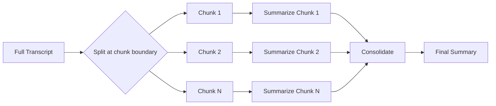

# Technical Decisions

This document catalogs the key technical decisions made during the development of LocalEcho, including the problem context, options considered, final decision, and rationale.

---

## 1. Architecture Pattern: MVVM with CommunityToolkit

**Context**: A cross-platform desktop/mobile app requiring clean separation of concerns, testability, and data-binding to XAML UI.

**Options Considered**:
- **Code-behind only**: Simple but unscalable; poor separation
- **MVC**: Not idiomatic for XAML-based UI frameworks
- **MVVM** (manual): Full control but verbose (boilerplate property definitions)
- **MVVM** (CommunityToolkit.Mvvm): Source-generated observable properties, commands, and messengers

**Decision**: **MVVM with CommunityToolkit.Mvvm source generators**

**Rationale**:
- `[ObservableProperty]` source generator eliminates boilerplate `INotifyPropertyChanged` implementations
- `[RelayCommand]` generates `ICommand` properties from methods — cleaner than manually creating `Command` objects
- Reduced per-property code from ~15 lines to 1 attribute
- Built-in messenger pattern for cross-ViewModel communication
- Industry-standard for .NET MAUI applications

```csharp
// Before (manual MVVM): 20+ lines
private string _statusText = "Ready";
public string StatusText
{
    get => _statusText;
    set { _statusText = value; OnPropertyChanged(); }
}

// After (CommunityToolkit): 1 line
[ObservableProperty]
public partial string StatusText { get; set; } = "Ready";
```

---

## 2. Audio Capture: Platform-Specific with Unified Interface

**Context**: Recording audio requires fundamentally different APIs on Windows (NAudio), macOS (AVFoundation), and Android (AudioRecord). Need a unified abstraction.

**Options Considered**:
- **Plugin/abstraction library**: Portable audio libraries exist but have limited feature coverage
- **Conditional compilation**: `#if WINDOWS / #elif MACCATALYST / #elif ANDROID`
- **Reflection/dynamic dispatch**: Runtime overhead, fragile

**Decision**: **Conditional compilation behind `IAudioService` interface**

**Rationale**:
- NAudio, AVFoundation, and Android AudioRecord are **not** available on other platforms — they can't be referenced at compile time
- Conditional compilation (`#if WINDOWS`) keeps dependencies scoped to their target platform
- The `IAudioService` interface provides a clean contract for the rest of the app
- `AudioStartResult` and `AudioStopResult` records encapsulate capture metadata cleanly

**Trade-offs**:
- AudioService.cs contains all three implementations — large file, but co-location aids maintenance
- Adding a new platform (e.g., iOS, Tizen) requires a new `#elif` block

---

## 3. LLM Inference: StatelessExecutor Over Stateful Context

**Context**: Running local LLMs with limited GPU memory, especially on consumer hardware with 4-8GB VRAM.

**Options Considered**:
- **Stateful context** (create `LLamaContext` per session): Reuse KV cache across calls — faster but memory-intensive
- **Stateless executor**: Creates context internally, no KV cache reuse — slower but memory-efficient

**Decision**: **StatelessExecutor**

**Rationale**:
- Phi-3 Mini + a stateful context with 4K context would require ~4GB just for KV cache on GPU
- Combined with GPU-offloaded model weights (~2.3GB), this exceeds available VRAM on many laptops
- `StatelessExecutor` creates context on-the-fly and frees it after inference
- Inference time is still acceptable for summarization (not real-time)
- For the chat feature, we cap output tokens at 500 to keep latency reasonable

---

## 4. Summarization Pipeline: Map-Reduce for Long Transcripts

**Context**: LLMs have fixed context windows (4K-16K tokens). Hour-long recordings produce transcripts exceeding this limit.

**Options Considered**:
- **Truncation**: Cut the transcript at the limit — loses information
- **Truncate + warn**: Cut and warn user — poor UX
- **Sliding window**: Overlapping windows — complex, inconsistent
- **Map-Reduce**: Split → summarize each chunk → consolidate

**Decision**: **Map-Reduce chunked summarization**

**Rationale**:
- Handles arbitrary-length transcripts without data loss
- Parallelizable — each chunk can be processed independently (though currently sequential)
- Consolidation step merges chunk summaries into coherent output
- Chunk size is model-aware: 5K chars for Phi-3 (4K context), 25K chars for Qwen/Llama (16K context)
- Short transcripts (< chunk size) skip the pipeline overhead with a direct single pass



---

## 5. Model Download: Streaming with Throttled Progress

**Context**: Whisper models (75MB-1.5GB) and LLM models (400MB-2.3GB) need to be downloaded efficiently with responsive UI updates.

**Options Considered**:
- **Simple `HttpClient.GetByteArrayAsync()`**: Blocks during large download, no progress
- **Streaming without throttle**: High-frequency progress callbacks flood UI thread
- **Streaming with throttle**: Report progress at ≥0.5% intervals

**Decision**: **Streaming download with throttled progress (≥0.5% interval)**

**Rationale**:
- `HttpCompletionOption.ResponseHeadersRead` enables streaming without buffering entire file in memory
- Progress throttling at 0.5% reduces `MainThread.BeginInvokeOnMainThread` overhead from ~200+ calls to ~200 calls (acceptable)
- Fallback to HuggingFace China mirror (`hf-mirror.com`) if primary download fails
- Partial file cleanup on failure prevents corrupted models

---

## 6. Audio Resampling Strategy

**Context**: Whisper requires 16kHz mono WAV input. Source recordings vary by platform and configuration.

**Options Considered**:
- **Streaming resampling**: Resample on-the-fly — complex cross-platform implementation
- **Temp file resampling**: Resample to a temporary WAV file, feed to Whisper

**Decision**: **Temp file resampling**

**Rationale**:
- Cross-platform audio resampling libraries in .NET are immature or unavailable
- Temp file approach is robust and platform-agnostic
- On Windows: NAudio `WdlResamplingSampleProvider` provides high-quality resampling
- On macOS/Android: The AudioService already records at 16kHz, so a copy suffices
- Temp file is cleaned up in `finally` block — no leakage
- Whisper.net supports processing from a `Stream`, but the temp file approach proved more reliable across platforms

---

## 7. RAG Approach: Search-Based Context Retrieval

**Context**: Users want to ask natural language questions about their entire library of recordings. Loading all entries exceeds LLM context windows.

**Options Considered**:
- **Full library load**: Load everything — exceeds context window for libraries with >3 entries
- **Vector embedding search**: Best semantic relevance — requires embedding model and vector DB
- **Keyword search + fallback**: Simple, effective, offline-capable

**Decision**: **Keyword-based search with latest-entry fallback**

**Rationale**:
- Adding vector embeddings (e.g., Sentence Transformers) would require another 100-400MB model download
- Keyword search using SQLite's LIKE queries is fast, offline, and zero-dependency
- "Latest entries" fallback for queries like "latest" and "recent" covers common use cases
- Results are limited to 5 entries to prevent context bloat
- Individual transcripts capped at 15K characters each

**Future improvement**: Add embedding-based semantic search as an optional upgrade path.

---

## 8. Model Selection for Summarization

**Context**: Multiple LLM models are available with different size/quality trade-offs.

**Options Considered**:
- **Single model**: Choose one — limited flexibility
- **Auto-detect best available**: Good UX but removes user control
- **User-selectable with auto-fallback**: Best of both worlds

**Decision**: **User-selectable models with automatic fallback chain**

**Selected models**:

| Model | Size | Quality | Speed | Use Case |
|---|---|---|---|---|
| Qwen 2.5 0.5B | ~400MB | Good | Fast | Default/recommended |
| Qwen 2.5 1.5B | ~1GB | Better | Moderate | Balanced |
| Llama 3.2 1B | ~1.3GB | Better | Moderate | Meta ecosystem |
| Phi-3 Mini | ~2.3GB | Best | Slowest | High-quality summaries |

**Rationale**:
- Qwen 0.5B is the default — small enough for any device, good enough for summarization
- Models are prioritized in order of reliability: Qwen05B → Qwen15B → Llama1B → Phi3Mini
- If the user's preferred model is unavailable, the system auto-selects the next best available
- Phi-3 Mini has a 4K context limitation — handled with smaller chunk sizes (5K chars) and reduced GPU layers (20)

---

## 9. Platform Target Selection

**Context**: .NET MAUI supports Windows, macOS, Android, iOS, and Tizen. Which platforms to target?

**Decision**: **Windows + macOS + Android (with conditional build targets)**

**Rationale**:
- **Windows**: Primary desktop target; full NAudio support for system audio capture
- **macOS**: Secondary desktop target; AVFoundation for audio
- **Android**: Mobile target; AudioRecord/MediaProjection for audio
- **iOS**: Currently excluded due to restrictive audio capture APIs and sandboxing
- **Tizen**: Excluded by default; conditional build comment in .csproj

Build targets are conditionally defined based on the host OS:
- Windows builds: `net9.0-windows10.0.19041.0;net9.0-android`
- macOS builds: `net9.0-maccatalyst;net9.0-android`
- Cross-platform builds: `net9.0-windows10.0.19041.0;net9.0-maccatalyst;net9.0-android`

---

## 10. Data Storage: SQLite with Lazy Initialization

**Context**: Need local persistence for transcription entries — titles, transcripts, summaries, metadata.

**Options Considered**:
- **JSON file**: Simple but no querying support
- **SQLite (sqlite-net-pcl)**: Lightweight, query-capable, cross-platform
- **LiteDB**: Document store, heavier dependency

**Decision**: **SQLite via sqlite-net-pcl with lazy initialization**

**Rationale**:
- sqlite-net-pcl is the most widely used SQLite ORM for .NET MAUI
- `SQLiteAsyncConnection` provides non-blocking database access
- Lazy initialization pattern (`private async Task Init()`) defers database creation until first use
- `CreateTableAsync` ensures schema exists without migrations
- The library only stores ~100-500 entries — well within SQLite's sweet spot
- No complex relationships — single table with all metadata denormalized
