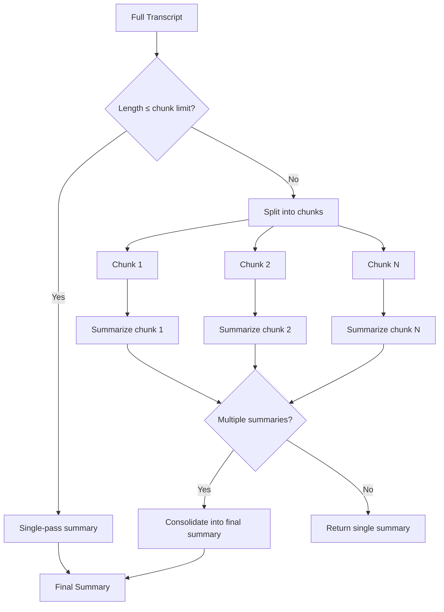

# 04. Map-Reduce Summarization Pipeline

Handling arbitrarily long transcripts by splitting, summarizing, and consolidating — all with model-specific context awareness.

---

## The Problem

LLMs have fixed context windows:
- **Phi-3 Mini**: 4,096 tokens (~5,000 characters of input)
- **Qwen/Llama**: 16,384 tokens (~25,000 characters)

A 1-hour recording easily produces 50,000+ characters of transcript. Simple truncation loses information.

---

## The Solution: Map-Reduce



---

## Implementation

```csharp
public async Task<string> SummarizeAsync(
    string transcript, SummaryType type = SummaryType.Concise)
{
    // 1. Pre-clean repetitions (e.g., from silence detection loops)
    var cleanedTranscript = CleanRepetitions(transcript);

    // 2. Model-aware chunk sizing
    int chunkMaxChars = _currentModelType == LlmModelType.Phi3Mini
        ? 5000   // 4K context → leaves room for prompt + generation
        : 25000; // 16K context → efficient batch processing

    // 3. Short transcript → single pass (skip overhead)
    if (cleanedTranscript.Length <= chunkMaxChars)
    {
        bool isShort = cleanedTranscript.Length < 500;
        int? maxTokens = isShort ? 300 : null;

        var lengthHint = isShort
            ? "Note: Very short recording. Keep your summary brief.\n"
            : "";

        var userPrompt = $"{lengthHint}Transcript:\n{cleanedTranscript}";
        return await GenerateResponseAsync(systemPrompt, userPrompt, maxTokens);
    }

    // 4. Map-Reduce: split → summarize → consolidate
    var chunks = SplitIntoChunks(cleanedTranscript, chunkMaxChars);
    var chunkSummaries = new List<string>();

    foreach (var chunk in chunks)
    {
        var chunkPrompt =
            $"Transcript (part {i + 1} of {chunks.Count}):\n{chunk}";
        var chunkSummary = await GenerateResponseAsync(
            systemPrompt, chunkPrompt);
        chunkSummaries.Add(chunkSummary);
    }

    // Single chunk produced a result? Return directly.
    if (chunkSummaries.Count <= 1)
        return chunkSummaries.FirstOrDefault()
            ?? "No content could be summarized.";

    // 5. Consolidate: merge all chunk summaries into final output
    return await ConsolidateSummariesAsync(chunkSummaries, type);
}
```

### Chunk Splitting

```csharp
private static List<string> SplitIntoChunks(string text, int maxChars)
{
    var chunks = new List<string>();
    var lines = text.Split(new[] { '\r', '\n' },
        StringSplitOptions.RemoveEmptyEntries);
    var current = new StringBuilder();

    foreach (var line in lines)
    {
        // If adding this line exceeds the limit,
        // finalize the current chunk
        if (current.Length + line.Length + 1 > maxChars
            && current.Length > 0)
        {
            chunks.Add(current.ToString().TrimEnd());
            current.Clear();
        }
        current.AppendLine(line);
    }

    if (current.Length > 0)
        chunks.Add(current.ToString().TrimEnd());

    return chunks;
}
```

**Why line-based splitting?** Syllable-based or character-based splitting could break mid-sentence, losing context for the chunk summary. Line-based splits naturally align with transcript segments (each line is a complete utterance).

### Consolidation

```csharp
private async Task<string> ConsolidateSummariesAsync(
    List<string> chunkSummaries, SummaryType type)
{
    var combined = string.Join("\n\n---\n\n", chunkSummaries);

    // Context-size aware truncation for consolidation
    int consolidationLimit = _currentModelType == LlmModelType.Phi3Mini
        ? 4000 : 20000;
    combined = TruncateIfNeeded(combined, consolidationLimit);

    var systemPrompt =
        "You are an expert editor. Below are summaries of " +
        "consecutive parts of one recording. " +
        "Combine them into a single, cohesive " +
        $"{(type == SummaryType.Detailed ? "detailed" : "concise")} " +
        "summary. Remove redundancy, merge related points, " +
        "and maintain chronological flow. " +
        "Output ONLY the final merged summary.";

    var userPrompt = $"Part summaries to merge:\n{combined}";
    return await GenerateResponseAsync(systemPrompt, userPrompt);
}
```

### Repetition Cleaning (Safety Net)

```csharp
private static string CleanRepetitions(string text)
{
    var lines = text.Split(new[] { '\r', '\n' },
        StringSplitOptions.RemoveEmptyEntries);
    var cleaned = new StringBuilder();
    string? prevCleanContent = null;
    int repeatCount = 0;

    foreach (var line in lines)
    {
        var trimmed = line.Trim();
        if (string.IsNullOrWhiteSpace(trimmed)) continue;

        // Extract content after timestamp [00:00:00]
        string cleanContent = trimmed;
        if (trimmed.StartsWith("[") && trimmed.Contains("] "))
        {
            var idx = trimmed.IndexOf("] ");
            cleanContent = trimmed.Substring(idx + 2).Trim();
        }

        if (cleanContent == prevCleanContent)
        {
            repeatCount++;
            if (repeatCount < 2) // Allow one natural repeat for emphasis
                cleaned.AppendLine(line);
        }
        else
        {
            repeatCount = 0;
            prevCleanContent = cleanContent;
            cleaned.AppendLine(line);
        }
    }

    return cleaned.ToString().TrimEnd();
}
```

**Why timestamp-aware?** Whisper outputs lines like `[00:00:01] Hello` and `[00:00:02] Hello`. Without stripping timestamps, these would look like different content. With timestamp awareness, the repetition detector correctly collapses them.

---

## Key Design Decisions

| Decision | Rationale |
|---|---|
| **Line-based chunking** | Preserves utterance boundaries; avoids mid-sentence splits |
| **Model-aware chunk size** | Phi-3 Mini (4K ctx) gets 5K char chunks; others get 25K |
| **Single-pass shortcut** | Short transcripts skip chunking overhead entirely |
| **Proportional length hint** | Very short recordings (<500 chars) get a brevity instruction |
| **Consolidation truncation** | Even the consolidation step is context-size aware |
| **Structured separator** | `\n\n---\n\n` between chunk summaries helps the LLM distinguish sections |
