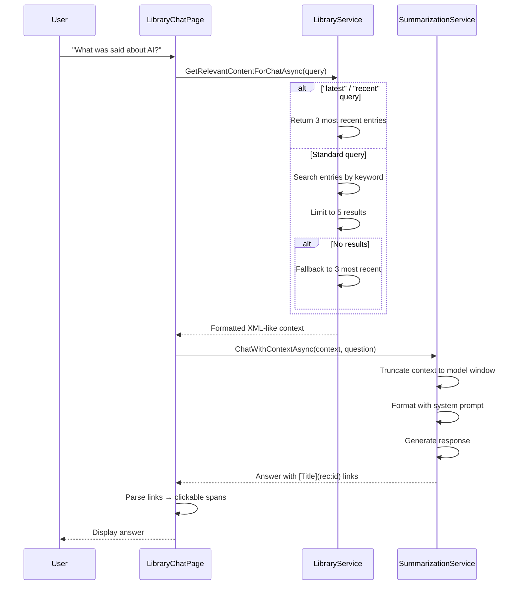

# 07. RAG Chat — "Library Brain"

Retrieval-Augmented Generation over the local transcript library, enabling natural language Q&A.

---

## Architecture



---

## Context Retrieval

```csharp
public async Task<string> GetRelevantContentForChatAsync(string query)
{
    // Special case for time-based queries
    var lowerQuery = query.ToLowerInvariant();
    if (lowerQuery.Contains("latest") ||
        lowerQuery.Contains("recent") ||
        lowerQuery.Contains("last"))
    {
        return FormatEntries(await GetTop3MostRecent());
    }

    // Standard search (keyword matching)
    var relevantEntries = await SearchEntriesAsync(query);

    // Cap at 5 entries to prevent context bloat
    if (relevantEntries.Count > 5)
        relevantEntries = relevantEntries.Take(5).ToList();

    // Fallback to recent entries if search yields nothing
    if (relevantEntries.Count == 0)
        relevantEntries = await GetTop3MostRecent();

    return FormatEntries(relevantEntries);
}

private string FormatEntries(List<TranscriptionEntry> entries)
{
    var sb = new StringBuilder();
    foreach (var entry in entries)
    {
        sb.AppendLine($"<Record id=\"{entry.Id}\" " +
            $"title=\"{entry.Title}\">");
        sb.AppendLine($"Date: {entry.Timestamp:yyyy-MM-dd HH:mm}");
        
        if (!string.IsNullOrWhiteSpace(entry.Summary))
            sb.AppendLine($"Summary: {entry.Summary}");
        
        if (!string.IsNullOrWhiteSpace(entry.Transcript))
        {
            var transcript = entry.Transcript;
            if (transcript.Length > 15000)  // Cap per-entry length
                transcript = transcript[..15000] +
                    "... [Truncated]";
            sb.AppendLine($"Transcript: {transcript}");
        }
        sb.AppendLine("</Record>");
    }
    return sb.ToString();
}
```

### Design Decisions

| Decision | Rationale |
|---|---|
| **XML-like format** | LLMs parse structured data better than plain text; XML delimiters help distinguish entries |
| **15K char cap per transcript** | Prevents a single massive entry from consuming the entire context window |
| **5 entry limit** | Balances coverage vs. context bloat; user can ask follow-ups for more |
| **"Latest" keyword detection** | Covers common conversational queries without requiring semantic understanding |
| **Recent fallback** | Ensures the chat always returns something useful, even for obscure queries |

---

## Chat Generation

```csharp
public async Task<string> ChatWithContextAsync(
    string context, string question)
{
    var systemPrompt =
        "You are the Library Brain, a precision-focused assistant. " +
        "Answer questions based on the <Record> data provided. " +
        "CRITICAL RULES:\n" +
        "1. Provide original, concise answers. " +
        "If referring to a recording, ALWAYS use this format: " +
        "[Title](rec:<id>).\n" +
        "2. If the user asks for 'latest' or 'recent' recordings, " +
        "the records provided are already sorted by date.\n" +
        "3. If the provided records don't contain the answer, say: " +
        "'I couldn't find a clear answer in the most relevant " +
        "recordings. Could you provide more details?'\n" +
        "4. Use synonyms for better matching but stay strictly " +
        "within the provided context.";

    // Model-specific context limit
    int contextChars = _currentModelType == LlmModelType.Phi3Mini
        ? 6000 : 32000;

    var userPrompt =
        $"[LIBRARY CONTEXT]\n{TruncateIfNeeded(context, contextChars)}\n\n" +
        $"[USER QUESTION]\n{question}";

    // Chat responses are capped at 500 tokens for speed
    return await GenerateResponseAsync(systemPrompt, userPrompt, 500);
}
```

### Prompt Engineering Highlights

- **`[Title](rec:<id>)` format**: Encourages the LLM to cite specific recordings with clickable links
- **Hard rules over suggestions**: "ALWAYS use this format" > "Consider using this format"
- **Negative instruction**: "Stay strictly within provided context" reduces hallucination
- **Model-specific truncation**: 6K chars for Phi-3 Mini, 32K for Qwen/Llama
- **Token cap**: 500 max tokens keeps chat responses fast (unlike summaries which may be longer)

---

## UI: Inline Recording Links

The chat UI parses `[Title](rec:<id>)` patterns into clickable spans:

```csharp
private void AddMessage(string text, bool isUser)
{
    var frame = new Frame { ... };

    if (isUser)
    {
        frame.Content = new Label { Text = text };
    }
    else
    {
        var formatted = new FormattedString();
        var regex = new Regex(@"\[(.*?)\]\(rec:(\d+)\)");
        var lastIndex = 0;

        foreach (Match match in regex.Matches(text))
        {
            // Add plain text before the match
            if (match.Index > lastIndex)
                formatted.Spans.Add(new Span
                {
                    Text = text[lastIndex..match.Index]
                });

            var title = match.Groups[1].Value;
            var id = match.Groups[2].Value;

            // Create a clickable link span
            var linkSpan = new Span
            {
                Text = title,
                TextColor = Color.FromArgb("#ac99ea"),
                TextDecorations = TextDecorations.Underline
            };

            var tapGesture = new TapGestureRecognizer();
            tapGesture.Tapped += async (_, _) =>
            {
                await Shell.Current.GoToAsync(
                    $"EntryDetailPage?id={id}");
            };
            linkSpan.GestureRecognizers.Add(tapGesture);
            formatted.Spans.Add(linkSpan);

            lastIndex = match.Index + match.Length;
        }

        // Add remaining text
        if (lastIndex < text.Length)
            formatted.Spans.Add(new Span
            {
                Text = text[lastIndex..]
            });

        frame.Content = new Label
        {
            FormattedText = formatted,
            TextColor = Colors.White
        };
    }
}
```

### UX Flow
1. User asks "What did I record about AI last week?"
2. LibraryService searches library → finds 3 relevant entries
3. Context formatted as `<Record>` blocks → sent to LLM
4. LLM returns: *"You recorded **[AI and the Future of Work](rec:42)**, which discusses..."*
5. Chat UI parses `[Title](rec:42)` → renders as clickable link
6. User clicks link → navigates to EntryDetailPage for recording 42

---

## Future Improvements

- **Vector embeddings**: Add Sentence Transformers for semantic search (optional model download)
- **Multi-turn conversation**: Maintain chat history across messages (currently stateless — each question is independent)
- **Hybrid search**: Combine keyword + vector search for best results
- **Query expansion**: Automatically generate related search terms from the user's question
- **Source highlighting**: Show which parts of which recordings support each answer
